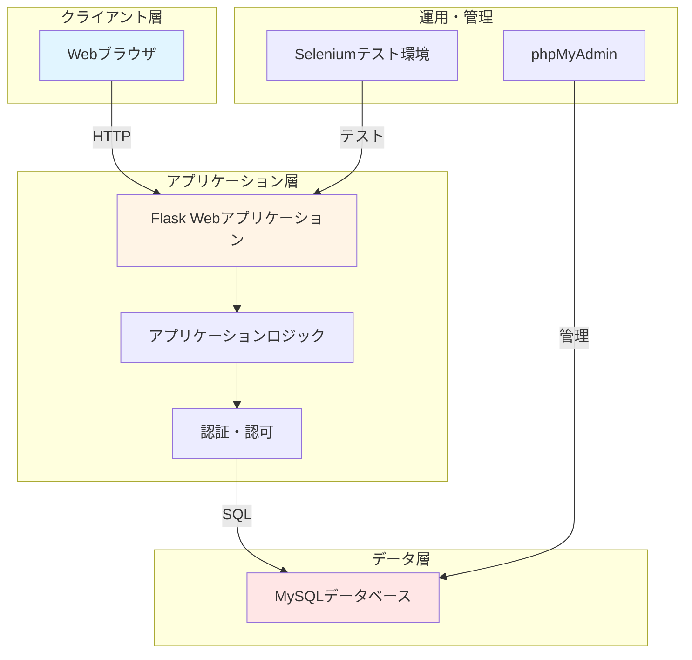
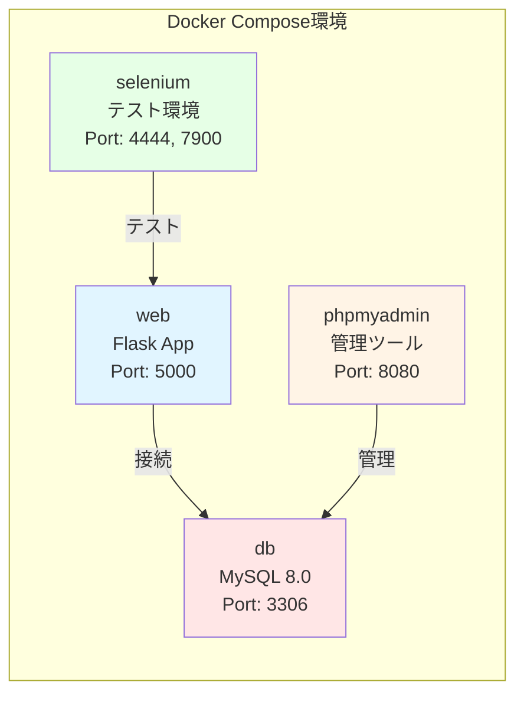
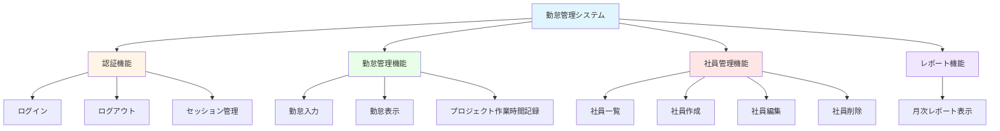
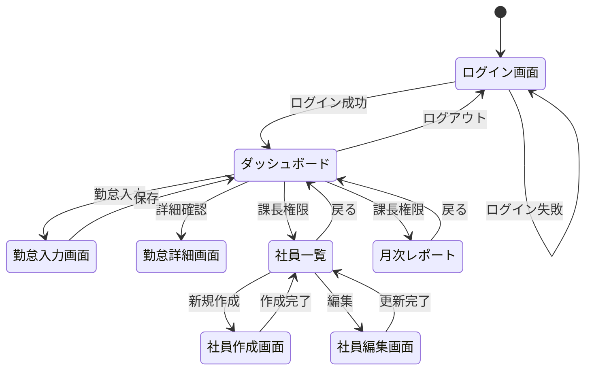
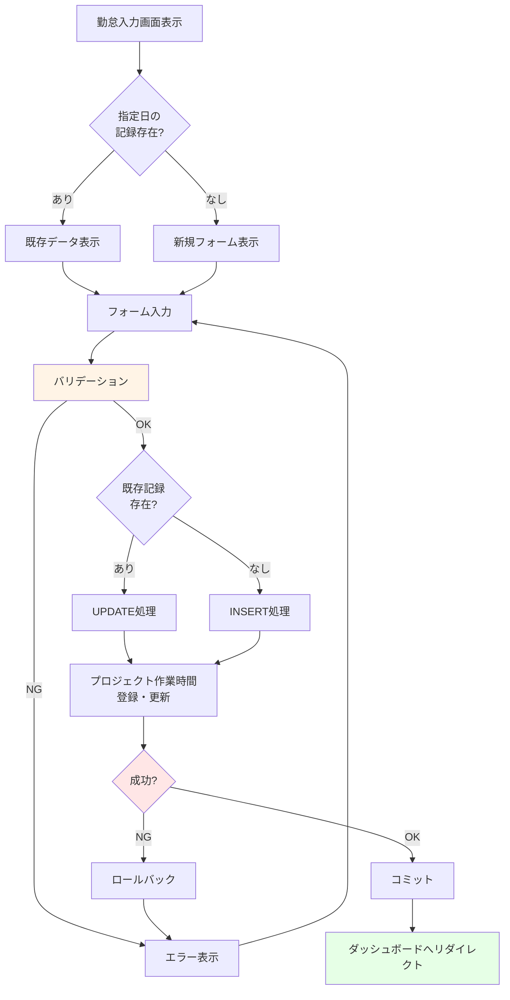
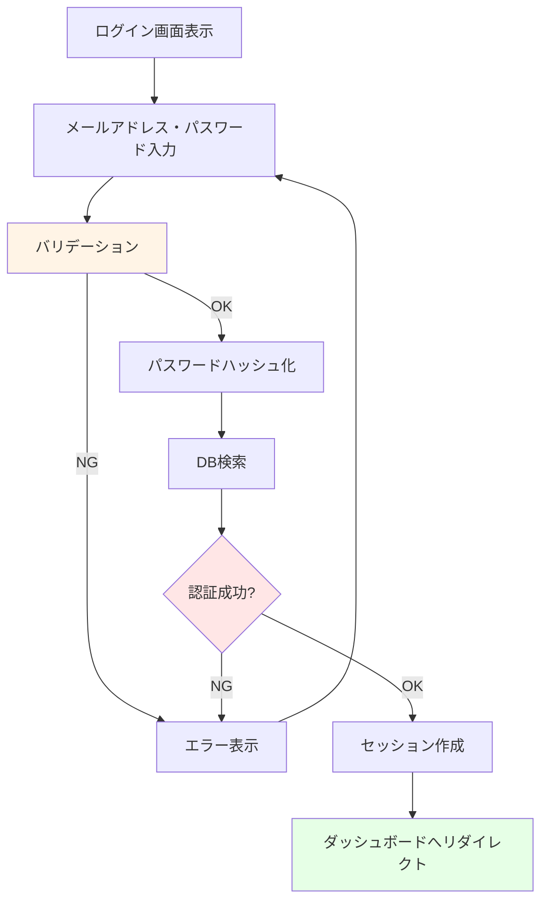

# 基本設計書（外部設計）

## 1. ドキュメント情報

| 項目 | 内容 |
|------|------|
| 文書名 | 基本設計書（外部設計） |
| バージョン | 1.0 |
| 作成日 | 2024-10-31 |
| 最終更新日 | 2024-10-31 |
| 作成者 | 開発チーム |

## 2. システム構成図

### 2.1 システム全体構成

### 2.2 コンテナ構成

## 3. 機能構成図

### 3.1 機能階層

## 4. 画面設計書

### 4.1 画面遷移図

### 4.2 画面一覧

| 画面ID | 画面名 | URL | 認証 | 権限 |
|--------|--------|-----|------|------|
| S001 | ログイン画面 | /login | 不要 | - |
| S002 | ダッシュボード | /dashboard | 必須 | 全ユーザー |
| S003 | 勤怠入力画面 | /attendance/input | 必須 | 全ユーザー |
| S004 | 勤怠詳細画面 | /attendance/view/<date> | 必須 | 全ユーザー |
| S005 | 社員一覧画面 | /employees | 必須 | 課長のみ |
| S006 | 社員作成画面 | /employees/create | 必須 | 課長のみ |
| S007 | 社員編集画面 | /employees/edit/<id> | 必須 | 課長のみ |
| S008 | 月次レポート画面 | /report/monthly | 必須 | 課長のみ |

### 4.3 画面設計詳細

#### S001: ログイン画面

**画面項目:**
- メールアドレス（テキスト入力）
- パスワード（パスワード入力）
- ログインボタン
- エラーメッセージ表示エリア

**バリデーション:**
- メールアドレス、パスワードは必須入力
- 認証失敗時はエラーメッセージを表示

#### S002: ダッシュボード

**画面項目:**
- ヘッダー（ログインユーザー名、ログアウトリンク）
- ナビゲーションメニュー
  - 勤怠入力
  - 社員管理（課長のみ）
  - 月次レポート（課長のみ）
- 今月の勤怠記録一覧（最大10件）
  - 日付
  - 出勤区分
  - 出勤時間
  - 退勤時間

#### S003: 勤怠入力画面

**画面項目:**
- 日付選択（カレンダーまたは日付入力）
- 出勤区分（ラジオボタンまたはセレクト）
  - 出勤、遅刻、早退、午前休、午後休、一日休
- 出勤時間（時間選択、15分単位）
- 退勤時間（時間選択、15分単位）
- 休憩時間（時間選択、15分単位、デフォルト1時間）
- 特記事項（テキストエリア）
- プロジェクト作業時間（動的フォーム）
  - プロジェクト選択
  - 作業時間入力
- 保存ボタン
- キャンセルボタン

**バリデーション:**
- 日付、出勤区分は必須
- 時間は15分単位のみ
- 出勤時間 < 退勤時間

#### S004: 勤怠詳細画面

**画面項目:**
- 日付
- 出勤区分
- 出勤時間
- 退勤時間
- 休憩時間
- 実働時間（自動計算）
- 特記事項
- プロジェクト作業時間一覧
- 編集リンク（自分の記録のみ）
- 戻るボタン

#### S005: 社員一覧画面

**画面項目:**
- 社員一覧テーブル
  - メールアドレス
  - 氏名
  - 権限
  - 作成日
  - 操作（編集、削除）
- 新規作成ボタン
- 戻るボタン

#### S006: 社員作成画面

**画面項目:**
- メールアドレス（テキスト入力）
- パスワード（パスワード入力）
- 氏名（テキスト入力）
- 権限（ラジオボタンまたはセレクト）
  - 社員（employee）
  - 課長（manager）
- 保存ボタン
- キャンセルボタン

**バリデーション:**
- すべての項目が必須
- メールアドレスの重複チェック

#### S007: 社員編集画面

**画面項目:**
- メールアドレス（テキスト入力、編集可能）
- パスワード（パスワード入力、任意）
- 氏名（テキスト入力）
- 権限（ラジオボタンまたはセレクト）
- 更新ボタン
- キャンセルボタン

**バリデーション:**
- メールアドレス、氏名は必須
- パスワードは変更する場合のみ入力
- メールアドレスの重複チェック（自分を除く）

#### S008: 月次レポート画面

**画面項目:**
- 年月選択（セレクト）
- レポートテーブル
  - 社員名
  - 出勤日数
  - 総労働時間
  - 総休憩時間
  - 実働時間
- 戻るボタン

## 5. 帳票設計書

### 5.1 月次レポート帳票

**帳票名:** 月次勤怠レポート

**出力形式:** Web画面表示（将来拡張：PDF/Excel出力）

**項目:**
- 対象年月
- 社員名
- 出勤日数
- 総労働時間（時間）
- 総休憩時間（時間）
- 実働時間（時間）

**集計方法:**
- 出勤日数：対象月の勤怠記録数
- 総労働時間：退勤時間 - 出勤時間の合計
- 総休憩時間：休憩時間の合計
- 実働時間：総労働時間 - 総休憩時間

## 6. 外部インターフェース設計書

### 6.1 現在の外部インターフェース

現在、外部システムとの連携はありません。

### 6.2 将来の拡張予定

- 給与計算システムとのAPI連携
- 申請・承認システムとのAPI連携

## 7. 入出力データ設計書

### 7.1 ログイン処理

**入力データ:**
- メールアドレス（string）
- パスワード（string）

**出力データ:**
- セッション情報（user_id, user_email, user_name, user_role）
- リダイレクト先（ダッシュボード）

### 7.2 勤怠記録入力

**入力データ:**
- date（YYYY-MM-DD）
- attendance_type（enum）
- start_time（HH:MM）
- end_time（HH:MM）
- break_time（HH:MM）
- notes（text）
- project_hours[]（配列）

**出力データ:**
- 保存結果（success/error）
- エラーメッセージ（エラー時）

### 7.3 社員作成

**入力データ:**
- email（string）
- password（string）
- name（string）
- role（enum）

**出力データ:**
- 作成結果（success/error）
- エラーメッセージ（エラー時）

### 7.4 月次レポート

**入力データ:**
- year（int）
- month（int）

**出力データ:**
- report_data[]（配列）
  - employee_name（string）
  - attendance_days（int）
  - total_hours（decimal）
  - total_break_hours（decimal）
  - actual_hours（decimal）

## 8. 業務処理フロー図

### 8.1 勤怠入力処理フロー

### 8.2 ログイン処理フロー

## 9. エラーハンドリング設計

### 9.1 エラー分類

| エラー種別 | 説明 | 処理 |
|-----------|------|------|
| 認証エラー | ログイン失敗 | エラーメッセージ表示、ログイン画面に留まる |
| 権限エラー | アクセス権限なし | エラーメッセージ表示、ダッシュボードへリダイレクト |
| バリデーションエラー | 入力値不正 | エラーメッセージ表示、入力画面に留まる |
| データベースエラー | DB接続・実行エラー | エラーログ出力、エラーメッセージ表示、ロールバック |
| システムエラー | 予期しないエラー | エラーログ出力、エラーメッセージ表示 |

### 9.2 エラーメッセージ一覧

| メッセージID | メッセージ内容 | 表示タイミング |
|-------------|--------------|--------------|
| E001 | ログインが必要です | 未ログイン時のアクセス |
| E002 | この機能は課長のみアクセスできます | 権限不足時のアクセス |
| E003 | メールアドレスとパスワードを入力してください | ログイン時の入力不足 |
| E004 | メールアドレスまたはパスワードが正しくありません | ログイン失敗 |
| E005 | 日付と出勤区分は必須です | 勤怠入力時の必須項目未入力 |
| E006 | すべての項目を入力してください | 社員作成時の必須項目未入力 |
| E007 | メールアドレスと名前は必須です | 社員編集時の必須項目未入力 |
| E008 | 勤怠記録が見つかりません | 存在しない記録へのアクセス |
| E009 | 社員が見つかりません | 存在しない社員へのアクセス |
| E010 | エラー: {詳細メッセージ} | その他のエラー |

### 9.3 成功メッセージ一覧

| メッセージID | メッセージ内容 | 表示タイミング |
|-------------|--------------|--------------|
| S001 | ようこそ、{ユーザー名}さん | ログイン成功 |
| S002 | 社員を作成しました | 社員作成成功 |
| S003 | 社員情報を更新しました | 社員更新成功 |
| S004 | 社員を削除しました | 社員削除成功 |

## 10. 権限・認可設計

### 10.1 権限一覧

| 権限種別 | 権限コード | 説明 |
|---------|-----------|------|
| 社員 | employee | 一般ユーザー権限 |
| 課長 | manager | 管理ユーザー権限 |

### 10.2 機能別アクセス制御

| 機能 | 未ログイン | employee | manager |
|------|----------|----------|---------|
| ログイン | ○ | ○ | ○ |
| ダッシュボード | × | ○ | ○ |
| 勤怠入力 | × | ○ | ○ |
| 勤怠表示 | × | ○（自分のみ） | ○（全社員） |
| 社員一覧 | × | × | ○ |
| 社員作成 | × | × | ○ |
| 社員編集 | × | × | ○ |
| 社員削除 | × | × | ○ |
| 月次レポート | × | × | ○ |

### 10.3 認可実装方式

- **デコレータによる実装**
  - `@login_required`: ログイン必須チェック
  - `@manager_required`: 課長権限必須チェック

- **セッション管理**
  - `session['user_id']`: ログインユーザーID
  - `session['user_role']`: ユーザー権限
  - `session['user_name']`: ユーザー名

## 11. メッセージ設計

### 11.1 フラッシュメッセージ

Flaskの`flash`機能を使用してメッセージを表示。

**メッセージタイプ:**
- `success`: 成功メッセージ（緑色）
- `error`: エラーメッセージ（赤色）
- `warning`: 警告メッセージ（黄色）
- `info`: 情報メッセージ（青色）

**表示位置:**
- 各ページの上部に表示
- 自動的に非表示になる（JavaScript実装推奨）

### 11.2 システムメッセージ

| 種別 | メッセージ | 説明 |
|------|----------|------|
| データベース初期化 | データベースの初期化が完了しました。 | 起動時の初期化完了 |
| データベース初期化エラー | データベース初期化エラー: {詳細} | 初期化失敗時 |

