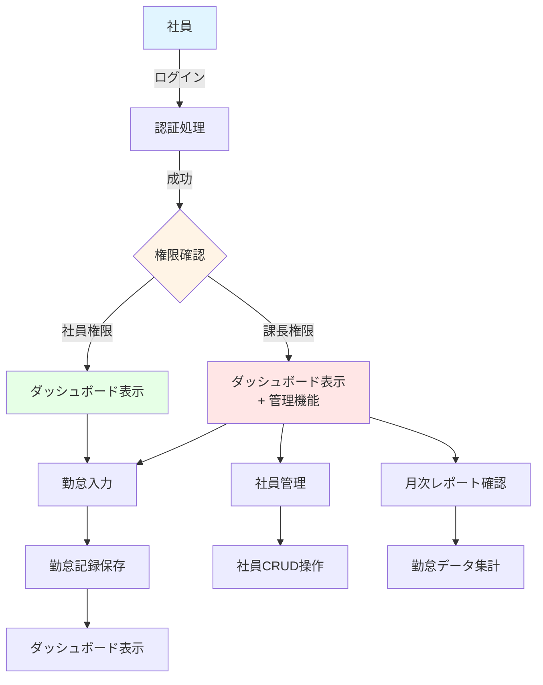

# 要件定義書

## 1. ドキュメント情報

| 項目 | 内容 |
|------|------|
| 文書名 | 要件定義書 |
| バージョン | 1.0 |
| 作成日 | 2024-10-31 |
| 最終更新日 | 2024-10-31 |
| 作成者 | 開発チーム |

## 2. プロジェクト概要

### 2.1 システム名
勤怠管理システム（Work Report System）

### 2.2 目的
社員の出勤・退勤記録、勤怠状況の管理、レポート生成を行うWebアプリケーションを開発する。
手作業による勤怠管理の手間を削減し、効率的な勤怠管理を実現する。

### 2.3 業務フロー図（To-Be）

## 3. 機能要件一覧

### 3.1 認証機能

| 機能ID | 機能名 | 説明 | 優先度 |
|--------|--------|------|--------|
| F001 | ログイン機能 | メールアドレスとパスワードによる認証 | 高 |
| F002 | ログアウト機能 | セッションを終了してログアウト | 高 |
| F003 | セッション管理 | ログイン状態の維持 | 高 |

**詳細要件:**
- メールアドレスとパスワードによる認証
- パスワードはSHA-256でハッシュ化して保存
- セッションはFlaskのsessionを使用
- ログイン状態は30分間有効（セッション設定）

### 3.2 勤怠入力機能

| 機能ID | 機能名 | 説明 | 優先度 |
|--------|--------|------|--------|
| F004 | 勤怠記録入力 | 日別の勤怠情報を入力 | 高 |
| F005 | 勤怠記録更新 | 既存の勤怠記録を更新 | 高 |
| F006 | 勤怠記録表示 | 勤怠記録を確認 | 高 |
| F007 | プロジェクト作業時間記録 | プロジェクト毎の作業時間を記録 | 中 |

**詳細要件:**
- 出勤時間、退勤時間、休憩時間は15分単位で入力
- 出勤区分：出勤、遅刻、早退、午前休、午後休、一日休
- 1日1レコードのみ記録可能（既存レコードがある場合は更新）
- プロジェクト毎の作業時間は任意で記録可能

### 3.3 社員管理機能（課長のみ）

| 機能ID | 機能名 | 説明 | 優先度 |
|--------|--------|------|--------|
| F008 | 社員一覧表示 | 登録されている社員の一覧を表示 | 高 |
| F009 | 社員作成 | 新しい社員アカウントを作成 | 高 |
| F010 | 社員情報更新 | 社員情報を編集 | 高 |
| F011 | 社員削除 | 社員アカウントを削除 | 中 |

**詳細要件:**
- 社員情報：メールアドレス、パスワード、氏名、権限（employee/manager）
- 課長権限を持つユーザーのみアクセス可能
- 社員削除時、関連する勤怠記録も削除（CASCADE）

### 3.4 レポート機能（課長のみ）

| 機能ID | 機能名 | 説明 | 優先度 |
|--------|--------|------|--------|
| F012 | 月次レポート表示 | 指定月の全社員の勤怠データを集計表示 | 高 |

**詳細要件:**
- 年月を指定してレポートを表示
- 集計項目：出勤日数、総労働時間、総休憩時間
- 全社員のデータを一覧表示

### 3.5 ダッシュボード機能

| 機能ID | 機能名 | 説明 | 優先度 |
|--------|--------|------|--------|
| F013 | ダッシュボード表示 | 今月の勤怠記録を一覧表示 | 高 |

**詳細要件:**
- ログイン後に表示されるメインページ
- 今月の勤怠記録を最大10件表示
- 権限に応じて表示内容を変更

## 4. 非機能要件定義

### 4.1 性能要件

| 項目 | 要件 | 備考 |
|------|------|------|
| レスポンス時間 | ページ表示は2秒以内 | 通常の操作 |
| 同時接続数 | 50ユーザーまで | 想定ユーザー数に基づく |
| データ保存期間 | 3年間 | 法定保存期間を考慮 |

### 4.2 セキュリティ要件

| 項目 | 要件 | 実装方法 |
|------|------|----------|
| 認証 | メールアドレスとパスワードによる認証 | SHA-256ハッシュ化 |
| セッション管理 | セッション固定化攻撃対策 | Flaskのセッション管理 |
| SQLインジェクション対策 | パラメータ化クエリを使用 | PyMySQLのパラメータ化 |
| XSS対策 | テンプレートエンジンによる自動エスケープ | Jinja2テンプレート |
| CSRF対策 | トークンによる保護 | Flask-WTF（将来拡張） |
| 権限管理 | ロールベースアクセス制御 | デコレータによる制御 |

### 4.3 可用性要件

| 項目 | 要件 |
|------|------|
| 稼働率 | 営業時間中（9:00-18:00）99%以上 |
| メンテナンス | 月次メンテナンスを想定 |

### 4.4 運用要件

| 項目 | 要件 |
|------|------|
| バックアップ | 日次自動バックアップ |
| ログ管理 | エラーログ、アクセスログの保存 |
| 監視 | システム状態の監視 |

### 4.5 互換性要件

| 項目 | 要件 |
|------|------|
| ブラウザ | Chrome、Firefox、Edge最新版対応 |
| レスポンシブ対応 | デスクトップ優先、モバイルは基本対応 |

## 5. システム構成要件

### 5.1 ハードウェア要件

| 項目 | 要件 |
|------|------|
| CPU | 2コア以上 |
| メモリ | 4GB以上 |
| ストレージ | 20GB以上 |

### 5.2 ソフトウェア要件

| 項目 | 要件 |
|------|------|
| OS | Linux（Docker環境） |
| Webサーバー | Flask 2.1.0（開発サーバー） |
| データベース | MySQL 8.0 |
| Python | 3.10 |
| コンテナ環境 | Docker、Docker Compose |

### 5.3 ネットワーク要件

| 項目 | 要件 |
|------|------|
| ポート | 5000（Web）、3306（MySQL）、8080（phpMyAdmin） |
| 通信プロトコル | HTTP/HTTPS（将来拡張） |

## 6. 外部インターフェース要件

### 6.1 現在の外部インターフェース

現在、外部システムとの連携はなし。

### 6.2 将来の拡張予定

- 給与計算システムとの連携（API連携）
- 申請・承認システムとの連携

## 7. データ要件

### 7.1 データ項目一覧

#### 7.1.1 社員マスタ（employees）

| 項目名 | データ型 | 説明 | 必須 |
|--------|---------|------|------|
| id | INT | 社員ID（主キー） | ○ |
| email | VARCHAR(255) | メールアドレス（ユニーク） | ○ |
| password | VARCHAR(255) | パスワード（ハッシュ化） | ○ |
| name | VARCHAR(100) | 氏名 | ○ |
| role | ENUM | 権限（employee/manager） | ○ |
| created_at | TIMESTAMP | 作成日時 | - |
| updated_at | TIMESTAMP | 更新日時 | - |

#### 7.1.2 プロジェクトマスタ（projects）

| 項目名 | データ型 | 説明 | 必須 |
|--------|---------|------|------|
| id | INT | プロジェクトID（主キー） | ○ |
| name | VARCHAR(100) | プロジェクト名 | ○ |
| created_at | TIMESTAMP | 作成日時 | - |
| updated_at | TIMESTAMP | 更新日時 | - |

#### 7.1.3 勤怠記録（attendance_records）

| 項目名 | データ型 | 説明 | 必須 |
|--------|---------|------|------|
| id | INT | 勤怠記録ID（主キー） | ○ |
| employee_id | INT | 社員ID（外部キー） | ○ |
| date | DATE | 日付 | ○ |
| attendance_type | ENUM | 出勤区分 | ○ |
| start_time | TIME | 出勤時間 | - |
| end_time | TIME | 退勤時間 | - |
| break_time | TIME | 休憩時間 | - |
| notes | TEXT | 特記事項 | - |
| created_at | TIMESTAMP | 作成日時 | - |
| updated_at | TIMESTAMP | 更新日時 | - |

#### 7.1.4 プロジェクト作業時間（project_hours）

| 項目名 | データ型 | 説明 | 必須 |
|--------|---------|------|------|
| id | INT | ID（主キー） | ○ |
| attendance_record_id | INT | 勤怠記録ID（外部キー） | ○ |
| project_id | INT | プロジェクトID（外部キー） | ○ |
| hours | DECIMAL(4,2) | 作業時間（時間単位） | ○ |
| created_at | TIMESTAMP | 作成日時 | - |
| updated_at | TIMESTAMP | 更新日時 | - |

### 7.2 データ制約

- 1社員につき、1日1レコードのみ（ユニーク制約）
- 社員削除時、関連する勤怠記録も削除（CASCADE）
- 時間は15分単位で管理

## 8. 制約条件・前提条件

### 8.1 制約条件

| 項目 | 制約内容 |
|------|----------|
| ブラウザ | モダンブラウザ（Chrome、Firefox、Edge）必須 |
| ネットワーク | 社内ネットワークからのアクセスを想定 |
| データ保持 | 3年間のデータ保持が必要 |

### 8.2 前提条件

| 項目 | 前提条件 |
|------|----------|
| Docker環境 | Docker、Docker Composeがインストールされていること |
| データベース | MySQLが正常に動作していること |
| ユーザー | 社員は基本的なPC操作ができること |

## 9. リスク・課題管理表

| ID | リスク・課題 | 影響度 | 発生確率 | 対策 |
|----|------------|--------|----------|------|
| R001 | パスワード漏洩 | 高 | 中 | パスワードをハッシュ化して保存 |
| R002 | SQLインジェクション | 高 | 低 | パラメータ化クエリを使用 |
| R003 | セッションハイジャック | 中 | 低 | セッション管理の強化（将来拡張） |
| R004 | データベース障害 | 高 | 低 | 定期バックアップの実施 |
| R005 | 同時アクセス時のパフォーマンス低下 | 中 | 中 | インデックスの最適化、キャッシュの検討 |

## 10. 用語集

| 用語 | 説明 |
|------|------|
| 社員 | システムを使用する一般ユーザー |
| 課長 | 社員管理とレポート閲覧が可能な管理ユーザー |
| 勤怠記録 | 1日分の出退勤情報 |
| 出勤区分 | 出勤、遅刻、早退、午前休、午後休、一日休のいずれか |
| プロジェクト作業時間 | プロジェクト単位で記録する作業時間 |

## 11. 承認

| 役割 | 承認者 | 承認日 | 署名 |
|------|--------|--------|------|
| プロジェクトマネージャー | - | - | - |
| ステークホルダー | - | - | - |

