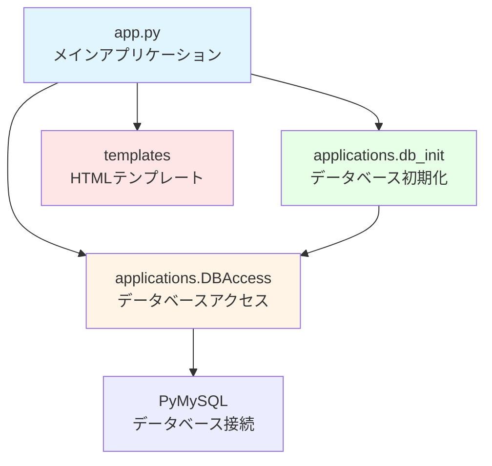
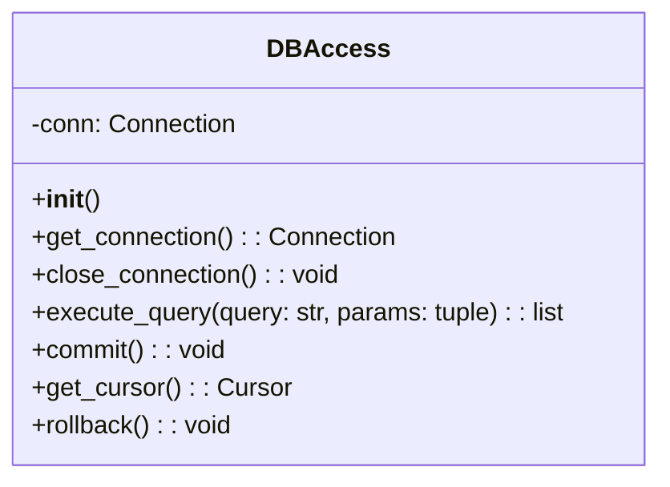
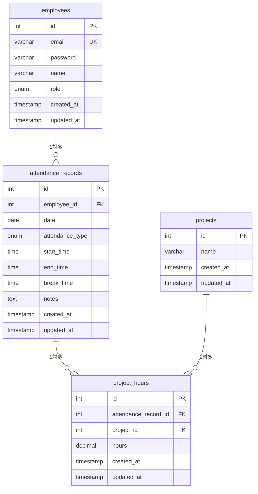
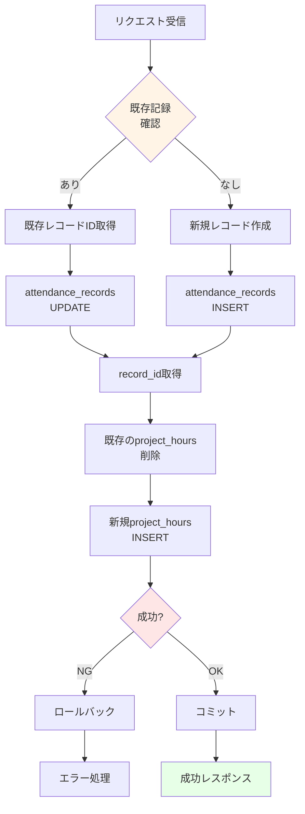

# 詳細設計書（内部設計）

## 1. ドキュメント情報

| 項目 | 内容 |
|------|------|
| 文書名 | 詳細設計書（内部設計） |
| バージョン | 1.0 |
| 作成日 | 2024-10-31 |
| 最終更新日 | 2024-10-31 |
| 作成者 | 開発チーム |

## 2. モジュール構成図

### 2.1 モジュール階層



## 3. クラス設計書

### 3.1 クラス一覧

| クラス名 | ファイル名 | 説明 |
|---------|-----------|------|
| DBAccess | applications/DBAccess.py | データベース接続管理クラス |

### 3.2 クラス詳細

#### 3.2.1 DBAccessクラス

**クラス名:** DBAccess

**責務:**
- MySQLデータベースへの接続管理
- SQLクエリの実行
- トランザクション管理

**クラス図:**



**メソッド一覧:**

| メソッド名 | 引数 | 戻り値 | 説明 |
|----------|------|--------|------|
| `__init__` | - | - | データベース接続を初期化 |
| `get_connection` | - | Connection | データベース接続を取得 |
| `close_connection` | - | void | データベース接続を閉じる |
| `execute_query` | query: str, params: tuple | list | SQLクエリを実行 |
| `commit` | - | void | トランザクションをコミット |
| `get_cursor` | - | Cursor | カーソルを取得 |
| `rollback` | - | void | トランザクションをロールバック |

**実装詳細:**

```python
class DBAccess:
    """
    DBAccessクラスは、MySQLデータベースへの接続を管理するクラスです。
    """
    
    def __init__(self):
        """
        データベース接続を初期化します。
        環境変数から接続情報を取得します。
        """
        self.conn = pymysql.connect(
            host=os.getenv('MYSQL_HOST', 'localhost'),
            user=os.getenv('MYSQL_USER', 'root'),
            password=os.getenv('MYSQL_PASSWORD', ''),
            database=os.getenv('MYSQL_DATABASE', 'flask_db'),
            charset='utf8mb4',
            cursorclass=pymysql.cursors.DictCursor
        )
```

### 3.3 関数（非クラス）

#### 3.3.1 デコレータ関数

**関数名:** `login_required`

**説明:** ログイン必須デコレータ

**実装:**

```python
def login_required(f):
    """
    ログイン必須デコレータ
    
    ログインしていないユーザーをログインページにリダイレクトします。
    """
    @wraps(f)
    def decorated_function(*args, **kwargs):
        if 'user_id' not in session:
            flash('ログインが必要です', 'warning')
            return redirect(url_for('login'))
        return f(*args, **kwargs)
    return decorated_function
```

**関数名:** `manager_required`

**説明:** 課長権限必須デコレータ

**実装:**

```python
def manager_required(f):
    """
    課長権限必須デコレータ
    
    課長権限を持たないユーザーをアクセス拒否します。
    """
    @wraps(f)
    def decorated_function(*args, **kwargs):
        if 'user_role' not in session or session['user_role'] != 'manager':
            flash('この機能は課長のみアクセスできます', 'error')
            return redirect(url_for('index'))
        return f(*args, **kwargs)
    return decorated_function
```

## 4. テーブル定義書

### 4.1 ER図



### 4.2 テーブル定義詳細

#### 4.2.1 employees（社員テーブル）

| カラム名 | データ型 | 制約 | 説明 |
|---------|---------|------|------|
| id | INT | PRIMARY KEY, AUTO_INCREMENT | 社員ID |
| email | VARCHAR(255) | UNIQUE, NOT NULL | メールアドレス |
| password | VARCHAR(255) | NOT NULL | パスワード（SHA-256ハッシュ） |
| name | VARCHAR(100) | NOT NULL | 氏名 |
| role | ENUM('employee', 'manager') | DEFAULT 'employee' | 権限 |
| created_at | TIMESTAMP | DEFAULT CURRENT_TIMESTAMP | 作成日時 |
| updated_at | TIMESTAMP | DEFAULT CURRENT_TIMESTAMP ON UPDATE CURRENT_TIMESTAMP | 更新日時 |

**インデックス:**
- PRIMARY KEY (id)
- UNIQUE KEY (email)

**備考:**
- emailは一意である必要がある
- roleは'employee'または'manager'のみ

#### 4.2.2 projects（プロジェクトテーブル）

| カラム名 | データ型 | 制約 | 説明 |
|---------|---------|------|------|
| id | INT | PRIMARY KEY, AUTO_INCREMENT | プロジェクトID |
| name | VARCHAR(100) | NOT NULL | プロジェクト名 |
| created_at | TIMESTAMP | DEFAULT CURRENT_TIMESTAMP | 作成日時 |
| updated_at | TIMESTAMP | DEFAULT CURRENT_TIMESTAMP ON UPDATE CURRENT_TIMESTAMP | 更新日時 |

**インデックス:**
- PRIMARY KEY (id)

#### 4.2.3 attendance_records（勤怠記録テーブル）

| カラム名 | データ型 | 制約 | 説明 |
|---------|---------|------|------|
| id | INT | PRIMARY KEY, AUTO_INCREMENT | 勤怠記録ID |
| employee_id | INT | NOT NULL, FOREIGN KEY | 社員ID |
| date | DATE | NOT NULL | 日付 |
| attendance_type | ENUM('出勤', '遅刻', '早退', '午前休', '午後休', '一日休') | DEFAULT '出勤' | 出勤区分 |
| start_time | TIME | NULL | 出勤時間 |
| end_time | TIME | NULL | 退勤時間 |
| break_time | TIME | DEFAULT '01:00:00' | 休憩時間 |
| notes | TEXT | NULL | 特記事項 |
| created_at | TIMESTAMP | DEFAULT CURRENT_TIMESTAMP | 作成日時 |
| updated_at | TIMESTAMP | DEFAULT CURRENT_TIMESTAMP ON UPDATE CURRENT_TIMESTAMP | 更新日時 |

**インデックス:**
- PRIMARY KEY (id)
- UNIQUE KEY unique_employee_date (employee_id, date)
- FOREIGN KEY (employee_id) REFERENCES employees(id) ON DELETE CASCADE

**備考:**
- 1社員につき1日1レコードのみ（UNIQUE制約）
- 社員削除時、関連する勤怠記録も削除（CASCADE）

#### 4.2.4 project_hours（プロジェクト作業時間テーブル）

| カラム名 | データ型 | 制約 | 説明 |
|---------|---------|------|------|
| id | INT | PRIMARY KEY, AUTO_INCREMENT | ID |
| attendance_record_id | INT | NOT NULL, FOREIGN KEY | 勤怠記録ID |
| project_id | INT | NOT NULL, FOREIGN KEY | プロジェクトID |
| hours | DECIMAL(4,2) | NOT NULL | 作業時間（時間単位） |
| created_at | TIMESTAMP | DEFAULT CURRENT_TIMESTAMP | 作成日時 |
| updated_at | TIMESTAMP | DEFAULT CURRENT_TIMESTAMP ON UPDATE CURRENT_TIMESTAMP | 更新日時 |

**インデックス:**
- PRIMARY KEY (id)
- FOREIGN KEY (attendance_record_id) REFERENCES attendance_records(id) ON DELETE CASCADE
- FOREIGN KEY (project_id) REFERENCES projects(id) ON DELETE CASCADE

**備考:**
- 1勤怠記録に対して複数のプロジェクト作業時間を記録可能

## 5. ロジック設計書

### 5.1 処理フロー

#### 5.1.1 勤怠記録登録・更新処理

**処理フロー:**



**詳細ロジック:**

1. **既存記録確認**
   ```sql
   SELECT id FROM attendance_records 
   WHERE employee_id = %s AND date = %s
   ```

2. **勤怠記録登録・更新**
   - 既存レコードがある場合：UPDATE
   - 既存レコードがない場合：INSERT

3. **プロジェクト作業時間処理**
   - 既存のproject_hoursを削除
   - 新しいproject_hoursをINSERT

4. **トランザクション管理**
   - エラー時はロールバック
   - 成功時はコミット

#### 5.1.2 パスワードハッシュ化処理

**アルゴリズム:** SHA-256

**実装:**
```python
import hashlib
password_hash = hashlib.sha256(password.encode()).hexdigest()
```

**備考:**
- 将来的にはbcrypt等のより安全なハッシュ化方式への移行を推奨

#### 5.1.3 時間フォーマット処理

**要件:**
- すべての時間は15分単位で管理
- TIME型（HH:MM:SS）で保存
- 表示時はHH:MM形式

**実装例:**
```python
# timedeltaオブジェクトを文字列に変換
if isinstance(time_value, timedelta):
    total_seconds = int(time_value.total_seconds())
    hours = total_seconds // 3600
    minutes = (total_seconds % 3600) // 60
    formatted_time = f"{hours:02d}:{minutes:02d}"
```

### 5.2 アルゴリズム仕様

#### 5.2.1 月次レポート集計

**処理概要:**
指定された年月の全社員の勤怠データを集計する。

**SQLクエリ:**
```sql
SELECT 
    e.id as employee_id,
    e.name as employee_name,
    COUNT(ar.id) as attendance_days,
    SUM(TIME_TO_SEC(TIMEDIFF(ar.end_time, ar.start_time)) / 3600) as total_hours,
    SUM(TIME_TO_SEC(ar.break_time) / 3600) as total_break_hours
FROM employees e
LEFT JOIN attendance_records ar ON e.id = ar.employee_id 
    AND ar.date >= %s AND ar.date <= %s
GROUP BY e.id, e.name
ORDER BY e.name
```

**集計項目:**
- attendance_days: 出勤日数（COUNT）
- total_hours: 総労働時間（SUM）
- total_break_hours: 総休憩時間（SUM）
- actual_hours: 実働時間（total_hours - total_break_hours、計算）

## 6. バッチ処理設計書

現在、バッチ処理は実装されていません。

### 6.1 将来の拡張予定

- 日次バッチ：前日の勤怠データの整合性チェック
- 月次バッチ：月次レポートの自動生成・メール送信

## 7. API設計詳細

### 7.1 エンドポイント一覧

| メソッド | エンドポイント | 認証 | 権限 | 説明 |
|---------|--------------|------|------|------|
| GET | / | - | - | インデックス（リダイレクト） |
| GET | /login | - | - | ログインフォーム表示 |
| POST | /login | - | - | ログイン処理 |
| GET | /logout | ○ | - | ログアウト処理 |
| GET | /dashboard | ○ | - | ダッシュボード表示 |
| GET | /attendance/input | ○ | - | 勤怠入力フォーム表示 |
| POST | /attendance/input | ○ | - | 勤怠記録登録・更新 |
| GET | /attendance/view/<date_str> | ○ | - | 勤怠詳細表示 |
| GET | /employees | ○ | manager | 社員一覧表示 |
| GET | /employees/create | ○ | manager | 社員作成フォーム表示 |
| POST | /employees/create | ○ | manager | 社員作成処理 |
| GET | /employees/edit/<employee_id> | ○ | manager | 社員編集フォーム表示 |
| POST | /employees/edit/<employee_id> | ○ | manager | 社員更新処理 |
| POST | /employees/delete/<employee_id> | ○ | manager | 社員削除処理 |
| GET | /report/monthly | ○ | manager | 月次レポート表示 |
| GET | /db/status | - | - | DB接続状態確認 |

### 7.2 リクエスト・レスポンス仕様

#### 7.2.1 POST /login

**リクエスト:**
- Content-Type: application/x-www-form-urlencoded
- パラメータ:
  - email: string（必須）
  - password: string（必須）

**レスポンス:**
- 成功: 302 Redirect → /dashboard
- 失敗: 200 OK（HTML、エラーメッセージ含む）

#### 7.2.2 POST /attendance/input

**リクエスト:**
- Content-Type: application/x-www-form-urlencoded
- パラメータ:
  - date: string（必須、YYYY-MM-DD）
  - attendance_type: string（必須、enum）
  - start_time: string（任意、HH:MM）
  - end_time: string（任意、HH:MM）
  - break_time: string（任意、HH:MM、デフォルト01:00）
  - notes: string（任意）
  - project_hours_{project_id}: float（任意、複数可）

**レスポンス:**
- 成功: 302 Redirect → /dashboard
- 失敗: 302 Redirect → /attendance/input（エラーメッセージ付き）

#### 7.2.3 POST /employees/create

**リクエスト:**
- Content-Type: application/x-www-form-urlencoded
- パラメータ:
  - email: string（必須）
  - password: string（必須）
  - name: string（必須）
  - role: string（必須、'employee'または'manager'）

**レスポンス:**
- 成功: 302 Redirect → /employees
- 失敗: 200 OK（HTML、エラーメッセージ含む）

#### 7.2.4 GET /report/monthly

**リクエスト:**
- クエリパラメータ:
  - year: int（任意、デフォルト: 今年）
  - month: int（任意、デフォルト: 今月）

**レスポンス:**
- 200 OK（HTML）
  - report_data: array of objects
    - employee_name: string
    - attendance_days: int
    - total_hours: decimal
    - total_break_hours: decimal

## 8. パラメータ定義書

### 8.1 セッションパラメータ

| パラメータ名 | 型 | 説明 |
|------------|---|------|
| user_id | int | ログインユーザーID |
| user_email | string | ログインユーザーのメールアドレス |
| user_name | string | ログインユーザーの氏名 |
| user_role | string | ログインユーザーの権限（'employee'または'manager'） |

### 8.2 フォームパラメータ

#### 8.2.1 ログインフォーム

| パラメータ名 | 型 | 必須 | 説明 |
|------------|---|------|------|
| email | string | ○ | メールアドレス |
| password | string | ○ | パスワード |

#### 8.2.2 勤怠入力フォーム

| パラメータ名 | 型 | 必須 | 説明 |
|------------|---|------|------|
| date | string | ○ | 日付（YYYY-MM-DD） |
| attendance_type | string | ○ | 出勤区分 |
| start_time | string | - | 出勤時間（HH:MM） |
| end_time | string | - | 退勤時間（HH:MM） |
| break_time | string | - | 休憩時間（HH:MM、デフォルト01:00） |
| notes | string | - | 特記事項 |
| project_hours_{project_id} | float | - | プロジェクト毎の作業時間 |

#### 8.2.3 社員作成・編集フォーム

| パラメータ名 | 型 | 必須 | 説明 |
|------------|---|------|------|
| email | string | ○ | メールアドレス |
| password | string | ○（作成時）、-（編集時） | パスワード |
| name | string | ○ | 氏名 |
| role | string | ○ | 権限（'employee'または'manager'） |

## 9. 例外処理設計

### 9.1 例外処理方針

- すべての例外はキャッチして処理
- ユーザーには分かりやすいエラーメッセージを表示
- 開発者向けには詳細なエラーログを出力

### 9.2 例外処理実装例

```python
try:
    # 処理
    db.execute_query(...)
    db.commit()
except Exception as e:
    db.rollback()
    flash(f'エラー: {str(e)}', 'error')
    print(f"エラーログ: {str(e)}")  # 実際にはloggingモジュールを使用
finally:
    db.close_connection()
```

### 9.3 例外種別

| 例外種別 | 説明 | 処理方法 |
|---------|------|----------|
| データベース接続エラー | DB接続失敗 | エラーメッセージ表示、ログ出力 |
| SQL実行エラー | SQL実行失敗 | ロールバック、エラーメッセージ表示 |
| バリデーションエラー | 入力値不正 | エラーメッセージ表示、入力画面に留まる |
| 認証エラー | 認証失敗 | ログイン画面へリダイレクト |
| 権限エラー | 権限不足 | ダッシュボードへリダイレクト |

## 10. ログ出力設計

### 10.1 ログ出力方針

- エラーログ：すべてのエラーを記録
- アクセスログ：重要な操作を記録（将来拡張）
- デバッグログ：開発時のみ出力（環境変数で制御）

### 10.2 ログ出力項目

| 種別 | 出力内容 |
|------|---------|
| エラーログ | エラーメッセージ、スタックトレース、タイムスタンプ |
| アクセスログ | ユーザーID、アクセスURL、メソッド、タイムスタンプ |
| データベース初期化ログ | 初期化成功/失敗、エラーメッセージ |

### 10.3 現在の実装

現在は`print`文を使用していますが、将来的には`logging`モジュールを使用することを推奨します。

## 11. 設定ファイル設計

### 11.1 環境変数

| 環境変数名 | 説明 | デフォルト値 |
|-----------|------|------------|
| FLASK_ENV | Flask環境 | development |
| FLASK_APP | Flaskアプリケーションファイル | app.py |
| SECRET_KEY | Flaskセッション用シークレットキー | dev-secret-key-change-in-production |
| MYSQL_HOST | MySQLホスト | localhost |
| MYSQL_USER | MySQLユーザー名 | root |
| MYSQL_PASSWORD | MySQLパスワード | （空） |
| MYSQL_DATABASE | MySQLデータベース名 | flask_db |

### 11.2 compose.yaml設定

Docker Composeで環境変数を管理しています。

### 11.3 将来の拡張

- .envファイルによる環境変数管理
- 設定ファイル（config.py）による設定管理

